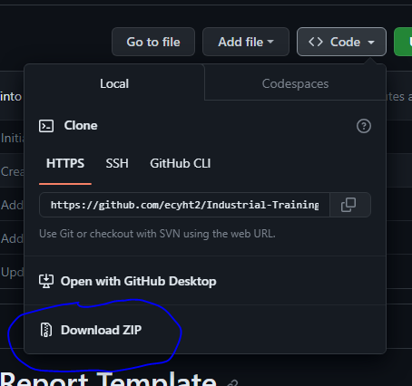

# Industrial Training Report Template
Template for Industrial Training Report in University of Nottingham.

## Requirements

Engine: XeLaTeX

### Packages

- fontspec
- geometry
- setspace
- graphicx
- biblatex

## Usage

### Getting the Template

#### Using git

1. Install [git](https://git-scm.com/) to your computer.
2. Change to desired directory.
```sh
cd /path/to/directory
```
3. Clone repository **Remember to change _directory\_name_ to the desired name of the folder**
```
git clone https://github.com/ecyht2/Industrial-Training-Report-Template.git directory_name
```

#### Using Zip

1. Download the ZIP file in the code dropdown.



3. Extract files to working directory.

#### Using GitHub

1. Sign in to GitHub
2. Click on the `Use this template` button.
3. Click `Create a new repository`.
4. Clone the repository. See [Using git](https://github.com/ecyht2/Industrial-Training-Report-Template#using-git)

#### Using Overleaf

TBA

### Changing Titlepage Information

This template provides commands to change the information the title page. All the commands available are shown in the table below.

|Command|Description|
|-------|-----------|
|`\faculty{faculty}`|Sets the faculty of the industrial training|
|`\module{module}`|Sets the industrial training module code and name|
|`\title{report title}`|Sets the title of the document|
|`\academicyear{year}`|Sets the academic year of the industrial training|
|`\author{author}`|Sets he author of the report|
|`\studentid{id}`|Sets the student ID of the author|
|`\degree{BEng/MEng}`|Sets the degree being pursued|
|`\department{department}`|Sets the department worked in the industrial training|
|`\orgname{company}`|Sets the company of the industrial training|
|`\orgaddr{address}`|Sets the address of the company|

## License

This repository including images except for Nottingham logo is license under [CC-BY-4.0](https://creativecommons.org/licenses/by/4.0/).
